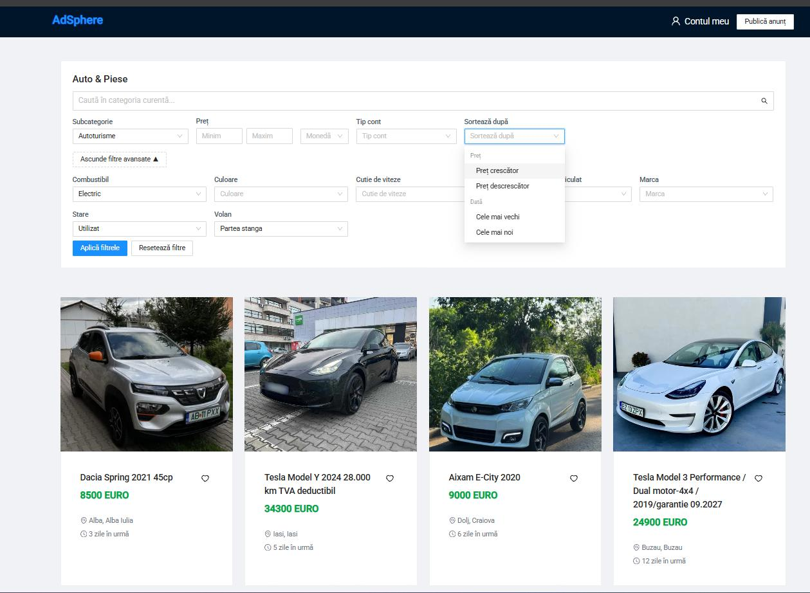
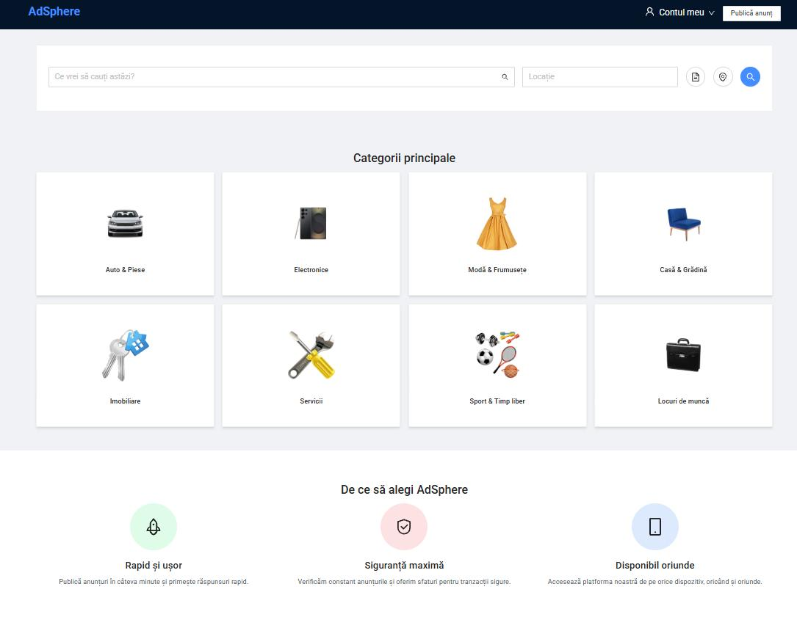
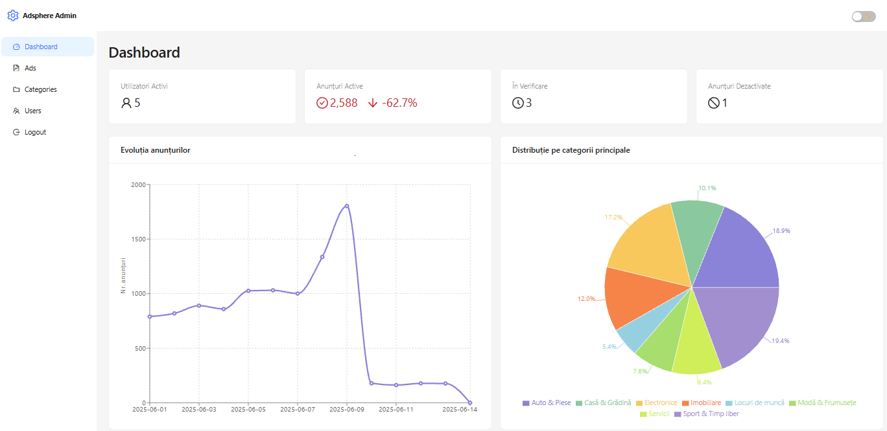
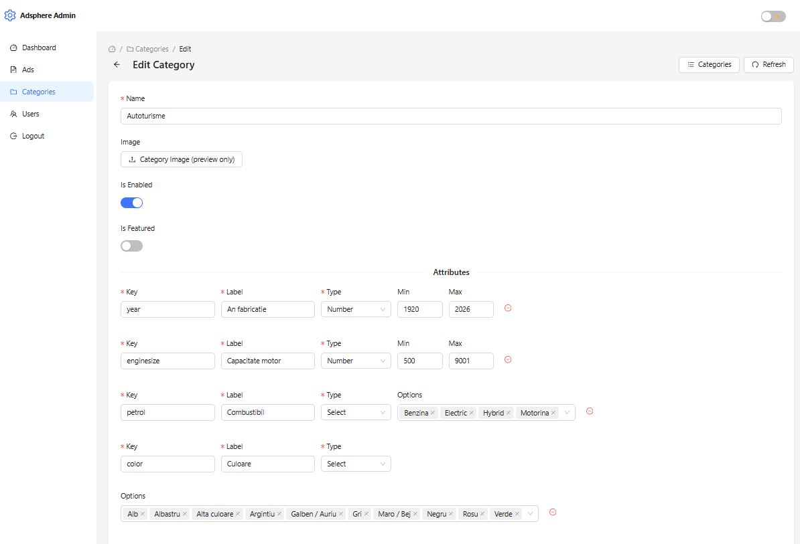

# AdSphere – Web Application for Managing Advertisements

AdSphere is my Master’s dissertation project: a modern classified ads platform for **products + services**, built with an industry-style stack and a modular architecture (UI + Admin + API + AI services).

## What it does
- Users can browse, search, filter, and post ads (dynamic fields by category)
- Messaging/contact between buyers and sellers
- Admin panel for moderation, categories, and users
- AI support for generating ad titles/descriptions + content moderation (service-based)

## Tech stack
- **UI:** Angular + NG-ZORRO
- **Admin:** React + Refine
- **API:** NestJS (JWT auth)
- **Data/Search/Messaging:** MongoDB, ElasticSearch, RabbitMQ
- **AI:** Python (FastAPI)
- **Infra:** Docker

## Screenshots

### Public UI
  

### Admin Panel
  

## Academic context
Developed as the practical implementation for my Master’s dissertation:  
**“Web Application for Managing Advertisements.”**
